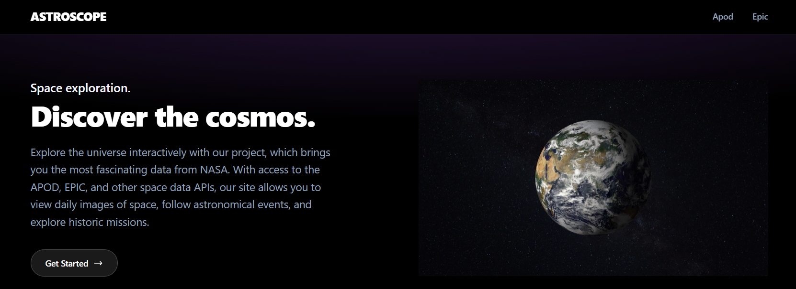

# 🚀AstroScope

<h3 align="center">Explore and visualize NASA space data through an interactive web application</h3>

<div align="center">

<br />



<br />

</div>


## 📋 Table of Contents

1. [Introduction](#-introduction)

2. [Tech Stack](#-tech-stack)

3. [Features](#-features)

4. [Quick Start](#-quick-start)

5. [Useful Links](#-useful-links)

---

## 🚀 Introduction

The goal of this application is to display data received from **NASA’s Open APIs** through a [backend](https://github.com/andersonfagundes/astroscope-api) service and provide an interactive platform for exploring space-related information in a clear and engaging way using **React**.

The project includes:

**React** and modern frontend development practices

1. **APOD (Astronomy Picture of the Day) API** - Fetch the NASA APOD data for a given date

2. **Fetch the NASA APOD data for a given datee** - EPIC (Earth Polychromatic Imaging Camera) API

---

## ⚙️ Tech Stack

- **React** – is a JavaScript library used to build interactive and dynamic user interfaces, mainly for web applications

---

## ⚡️ Features

### 🌌 Astronomy Picture of the Day (APOD)

- 🔭 **Astronomy Picture of the Day** - Explore NASA’s daily featured space imagery with rich contextual information.

### 🌎 Earth Polychromatic Imaging Camera (EPIC)

- 🎥 **Earth Polychromatic Imaging Camera** - Visualize Earth from space through NASA’s EPIC satellite imagery.

---

## ▶️ Quick Start

### Prerequisites

- [Node.js](https://nodejs.org/) (v24.14.1 or higher)

- [Git](https://git-scm.com/)

### Installation

1. **Clone the repository**

```bash
git clone https://github.com/andersonfagundes/astroscope-web
```

2. **Install dependencies**

```bash
npm install
```

3. **Set up**

To run this project, you first need to set up and run the [astroscope-api](https://github.com/andersonfagundes/astroscope-api).

4. **Start the development server**

```bash
cd astroscope-web
npm run dev
```

---

## 🔗 Useful Links

- [React](https://react.dev)

- [NASA API key](https://api.nasa.gov/)

---

## 📝 License

This project is open source and available under the [MIT License](LICENSE).

---
